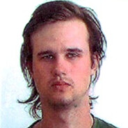

# Contact information


| | Aleksey Cherkas|
|------|:----:|
|   |  [](Aleksey.cherkas99@gmail.com) [](https://t.me/GenryMilligan) [](https://vk.com/aleksey_poster) [](discordapp.com/users/708753695311134730)| 


# About

When I was young - 13 yeas old, I made My first program. It was *Hello World* on the language Java. From this point I try to find My place in the Information Technologies industry. Now I 24 years old and I worked like designer, typographer, programmer, software tester and moderator. In My opinion, Frontend developer job include all what I prefer in My last jobs. 

# Knowledges

1. Frontend
    * HTML, CSS, JavaScript
    * Photoshop, Inkscape
2. Backend
    * Linux basics
    * Docker + Portainer

# Code Example

## Now I want to show few example of My favarite tasks.

### This is one of many ways how to use infinity loop

```
function nbYear(p0, percent, aug, p) {
  let yaerCou = 0;
  let newPercent = percent / 100;
  let population = p0;
  let targetPop = p;
  let newPop = 0;
  
  //unlimited loop for counting years

  for(; ;) {
    //round funcrion for double numbers
     function round(item) {
      return item.toFixed()
    }

    newPop = round(population);
    newPop = parseInt(newPop);
    
    population = newPop + (newPop * newPercent)  + aug;
    yearCou++;
 
    //loop exit
    if(population > targetPop || population == targetPop) break;
    
  }
  //return answer
  return yearCou;
}
```
### .map() function case

```
String.prototype.toAlternatingCase = function () {
  let simpleStr = this.toString().split("");
  

 /* 
  Modifying string with .map() function
  var char is target modyfing var
  /[a-z]/ regEx for usage .test()
*/
  return simpleStr.map(char => {
    if(/[a-z]/.test(char)) return char.toUpperCase();
    if(/[A-Z]/.test(char)) return char.toLowerCase();
    else return char;
  }).join('');
}
```

### My favorite and hardest code example - Caesar Cipher.

```
function rot13(correspondance) {
    const charCode = correspondance.charCodeAt();
    // is it rus?
    if ((charCode >= 1040 && charCode <= 1071) || charCode === 1025) {
      
      // for russian latters we are need new script, because some latters have been missed in queue

      let alphabetRU = "АБВГДЕЁЖЗИЙКЛМНОПРСТУФХЦЧШЩЪЫЬЭЮЯ";
      
      /*
      Use .indexOf for find latter
      Use shiftNum for shift this latter
      If we are out of range use % for reduce numbers 
      Num 33 is for range fitting
      */

      return alphabetRU[
        alphabetRU.indexOf(correspondance) + shiftNum <= 32
          ? alphabetRU.indexOf(correspondance) + shiftNum
          : (alphabetRU.indexOf(correspondance) + shiftNum) % 33
      ];
    } else {
      //Its original script from stackoverflow      
      // A = 65, Z = 90

      return String.fromCharCode(
        charCode + shiftNum <= 90
          ? charCode + shiftNum
          : ((charCode + shiftNum) % 90) + 64
      );
    }
}
```

# Projects

|[Landing Page](https://robingooze.github.io/csb-kyvldt/)|[Ceasar Cipher Page](https://robingooze.github.io/csb-5bco2b/)|
|:----------:|:-------:|
| Simple project what solve simple quastion|More harder to make, but easy to use|


# Education
1. College of communication in Brest
2. Czech language course in LLI Brno University of Technology
3. freeCodeCamp
    - [Responsive Web Design](https://freecodecamp.org/certification/TheRedMan/responsive-web-design)
    - [JavaScript Algorithms and Data Structures](https://freecodecamp.org/certification/TheRedMan/javascript-algorithms-and-data-structures)


# English level
I hope my English on B2 level. Officially, I never take the exam. When I study in Brno I had some English practice with native speaker and I had roommate who spoke English.
